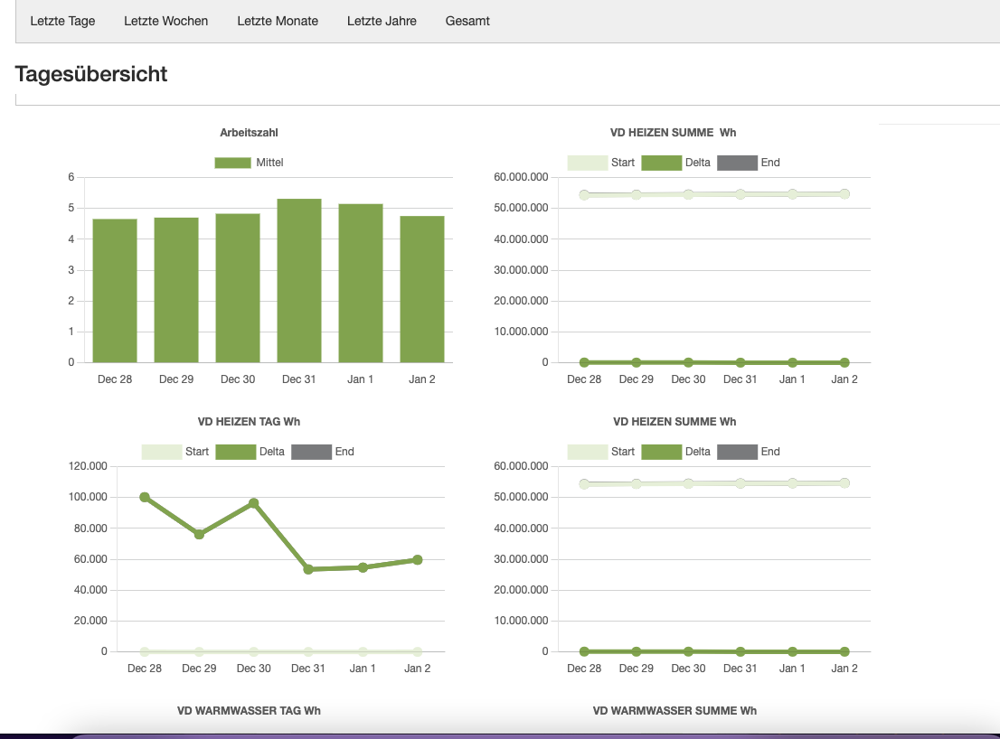

<!--
*** Thanks for checking out the Best-README-Template. If you have a suggestion
*** that would make this better, please fork the repo and create a pull request
*** or simply open an issue with the tag "enhancement".
*** Thanks again! Now go create something AMAZING! :D
-->


<!-- PROJECT SHIELDS -->
<!--
*** I'm using markdown "reference style" links for readability.
*** Reference links are enclosed in brackets [ ] instead of parentheses ( ).
*** See the bottom of this document for the declaration of the reference variables
*** for contributors-url, forks-url, etc. This is an optional, concise syntax you may use.
*** https://www.markdownguide.org/basic-syntax/#reference-style-links
-->

<br />

  <h3 align="center">SQL Server on Linux + ASP.NET 5.0 stiebel-eltron-dashboard demo</h3>

  <p align="center">
    <br />
    <a href="https://github.com/marcflohrer/AspNetOnSqlServer"><strong>Explore the docs »</strong></a>
    <br />
    <br />
    <a href="https://github.com/marcflohrer/AspNetOnSqlServer/issues/new/choose">Report Bug</a>
    ·
    <a href="https://github.com/marcflohrer/AspNetOnSqlServer/issues">Request Feature</a>
  </p>
</p>


<!-- TABLE OF CONTENTS -->
<details open="open">
  <summary>Table of Contents</summary>
  <ol>
    <li>
      <a href="#about-the-project">About The Project</a>
      <ul>
        <li><a href="#built-with">Built With</a></li>
      </ul>
    </li>
    <li>
      <a href="#getting-started">Getting Started</a>
      <ul>
        <li><a href="#prerequisites">Prerequisites</a></li>
        <li><a href="#installation">Installation</a></li>
      </ul>
    </li>
  </ol>
</details>


<!-- ABOUT THE PROJECT -->
## About The Project

This project is intended to provide a more insightful presentation of the data provided by the original Stiebel Eltron dashboard.
On top it adds the missing performance factor chart (Arbeitszahl).

### Built With

This section lists major frameworks and projects that were used:

* [docker-compose](https://docs.docker.com/compose/)
* [docker](https://docs.docker.com/)
* [Asp.net](https://dotnet.microsoft.com/apps/aspnet)
* [SQL Server on Linux](https://docs.microsoft.com/en-us/sql/linux/sql-server-linux-overview?view=sql-server-ver15)
* [aspnetcore/src/Identity/samples/IdentitySample.Mvc/](https://github.com/dotnet/aspnetcore/tree/main/src/Identity/samples/IdentitySample.Mvc) that is [licensed under Apache 2.0](legal/aspnetcore/LICENSE) (Notice: Some files are changed.)
* [marcflohrer/AspNetOnSqlServer](https://github.com/marcflohrer/AspNetOnSqlServer)
* [zzzprojects/html-agility-pack](https://github.com/zzzprojects/html-agility-pack)
* [xunit/xunit](https://github.com/xunit/xunit)
* [HangfireIO/Cronos](https://github.com/HangfireIO/Cronos)
* [aspnet/Identity](https://github.com/aspnet/Identity)
* [dotnet/efcore](https://github.com/dotnet/efcore)
* [AutoFixture/AutoFixture](https://github.com/AutoFixture/AutoFixture)
* [microsoft/vstest](https://github.com/microsoft/vstest)
* [xunit/xunit](https://github.com/xunit/xunit)
* [chartjs](https://github.com/chartjs)
* [jquery/jquery](https://github.com/jquery/jquery)
* [twbs/bootstrap](https://github.com/twbs/bootstrap)
* [jsdelivr/bootstrapcdn](https://github.com/jsdelivr/bootstrapcdn)

## What is it

This project prvides a dashboard for the things that are missing in the dashboard provided with a Stiebel Eltron(R) heat pump:

* charts showing the performance factor evolving over time plus the performance factor for the whole operating time of the heat pump.
* charts showing all the metrics in a chart that puts them in a historic context: recent days, recent weeks, months and years.

Here is a screen shot of the dashboard:



## Known limitations

* This project has only been tested with the heat pump version WPL 20 A.
* The dashboard labels are partly in German and there is no option to change the language.

### Prerequisites

You need docker and docker-compose on the machine where you want to run the application:

* docker

### Start the app

1. Clone the repo on a raspberry pi for example:

   ```sh
   git clone https://github.com/your_username_/Project-Name.git
   ```

2. Put a .env file in the **src** folder with the data that match your environment:

   ```.env
   DatabasePassword="YourStr0ngP@ssword!"
   DatabaseConnectionString="Server=db;Database=master;User=sa;Password=YourStr0ngP@ssword!;"
   ServiceWeltUser="<My-ServiceWelt-User-Name-Goes-here>"
   ServiceWeltPassword="<Y0urStr0ng$ἔrvicἔWἔltP@sswØrd>"
   ServiceWeltUrl="http://192.XXX.XXX"
   ```

3. Install docker & docker-compose:

   ```sh
   curl -fsSL https://get.docker.com -o get-docker.sh
   sh get-docker.sh
   sudo usermod -aG docker $USER
   ```

   Restart the pi and check if it was successful:

   ```sh
   docker container run hello-world
   ```

   For detailled instructions on how to install docker an a raspberry pi see [here (German)](https://www.randombrick.de/raspberry-pi-docker-installieren-und-nutzen/).

   Then install docker-compose:

   ```sh
   sudo apt-get install libffi-dev libssl-dev
   sudo apt install python3-dev
   sudo apt-get install -y python3 python3-pip
   sudo pip3 install docker-compose
   ```

   For detailled instructions on how to install docker-compose an a raspberry pi see [here (English)](https://devdojo.com/bobbyiliev/how-to-install-docker-and-docker-compose-on-raspberry-pi).

4. Before starting the app for the first time on a specific machine go to the **src** folder and run:

   ```sh
   ./start-dbmigrating.sh
   ```

5. Start the app:

   ```sh
   ./startup-app.sh
   ```
  
6. Open [http://localhost](http://localhost) in any browser. If your raspberry pi is reachable in your local network you can replace localhost with the respective IP address.

7. If you want to contribute to the project and you need to change the database structure you can use the following script to check if your database changes were successful:

   ```sh
   ./start-dbscaffolding.sh
   ```
